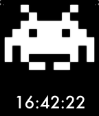

PebbleInvader
=============

A Pebble watchface that demonstrates a basic, efficient, two-frame animation technique. Plus, it has a Space Invader.

# The idea

We load the bitmaps into memory when the watch face is initialized. When the second tick callback is triggered, it marks the graphic view as dirty and in need of redrawing. The draw routine then checks the current time, does a mod 2 on the seconds field, and draws one frame or the other based on the result. While we still update a large portion of the screen, it's still pretty efficient, as the update only happens once per second, with the Pebble in deep sleep between updates.

This could easily be expanded to support more frames in an animation if one wished simply by adding additional assets and tweaking the draw logic.

# Known issues

* It seems there may be issues with memory management on the Pebble, as my device occasionally gets into a peculiar state where it appears to be having trouble loading font and image assets, and eventually reboots. I'm not sure if this is an issue with my code or with the Pebble OS.
* This was a learning exercise for me, so the code's less clean that I generally like.
* The bitmap assets should ideally be 1-bit. Mine aren't, because I was using a graphics package that doesn't offer 1-bit export. Next time, I'll use Gimp.

# Planned Features

* Add additional graphics.

# Revision History

## v0.1: May 16, 2013

* Initial release, upload to GitHub

# License

License (MIT)

Copyright (c) 2013 Sean McMains, @SeanMcTex

Permission is hereby granted, free of charge, to any person obtaining a copy of this software and associated documentation files (the "Software"), to deal in the Software without restriction, including without limitation the rights to use, copy, modify, merge, publish, distribute, sublicense, and/or sell copies of the Software, and to permit persons to whom the Software is furnished to do so, subject to the following conditions:

The above copyright notice and this permission notice shall be included in all copies or substantial portions of the Software.

THE SOFTWARE IS PROVIDED "AS IS", WITHOUT WARRANTY OF ANY KIND, EXPRESS OR IMPLIED, INCLUDING BUT NOT LIMITED TO THE WARRANTIES OF MERCHANTABILITY, FITNESS FOR A PARTICULAR PURPOSE AND NONINFRINGEMENT. IN NO EVENT SHALL THE AUTHORS OR COPYRIGHT HOLDERS BE LIABLE FOR ANY CLAIM, DAMAGES OR OTHER LIABILITY, WHETHER IN AN ACTION OF CONTRACT, TORT OR OTHERWISE, ARISING FROM, OUT OF OR IN CONNECTION WITH THE SOFTWARE OR THE USE OR OTHER DEALINGS IN THE SOFTWARE.